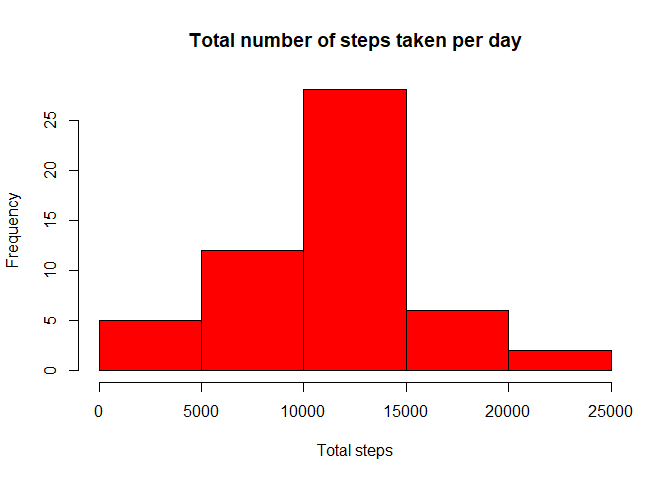
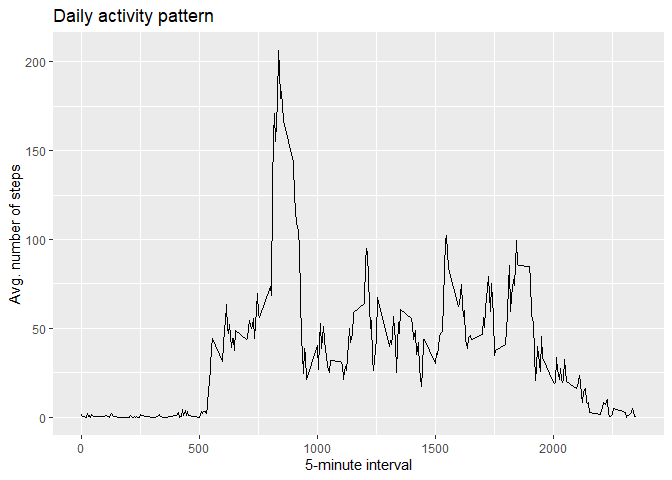
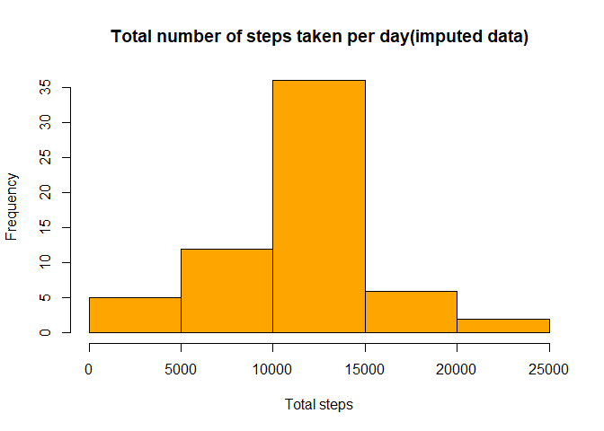
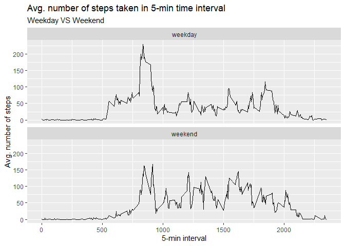

## Loading and preprocessing the data

- We can start with download the file from given [URL link](https://d396qusza40orc.cloudfront.net/repdata%2Fdata%2Factivity.zip/).  Since downloaded file is a zipfile, it should be unzip and read by read.csv function
 

```r
if(!file.exists("./data")) {dir.create("./data")}

fileUrl <- "https://d396qusza40orc.cloudfront.net/repdata%2Fdata%2Factivity.zip"
download.file(fileUrl, destfile = "./data/activity.zip")

zFilepath <- "./data/activity.zip"
dir <- "./data"
unzip(zFilepath, exdir = dir)

filePath <- "./data/activity.csv"
rawDt <- read.csv(file = filePath)
```

 - Let's see how the data look like


```r
str(rawDt)
```

```
## 'data.frame':	17568 obs. of  3 variables:
##  $ steps   : int  NA NA NA NA NA NA NA NA NA NA ...
##  $ date    : Factor w/ 61 levels "2012-10-01","2012-10-02",..: 1 1 1 1 1 1 1 1 1 1 ...
##  $ interval: int  0 5 10 15 20 25 30 35 40 45 ...
```

 - For convenience, we transform class of 'date' variable to *Date class* variable.  Then assign it to **proDt**


```r
rawDt$date <- as.Date(as.character(rawDt$date, "%Y-%m-%d"))
proDt <- rawDt
str(proDt)
```

```
## 'data.frame':	17568 obs. of  3 variables:
##  $ steps   : int  NA NA NA NA NA NA NA NA NA NA ...
##  $ date    : Date, format: "2012-10-01" "2012-10-01" ...
##  $ interval: int  0 5 10 15 20 25 30 35 40 45 ...
```


## What is mean total number of steps taken per day?

 - There are several ways too calculate total number of steps per day, and we are going to use `aggregate` function.  Given the condition that we can ignore the missing values in the dataset, we just use default setting(`na.action = na.omit`) to deal with missing values.
 - To use `aggregate` function for the calculation and assign it to **total**


```r
total <- aggregate(steps ~ date, rawDt, sum)
head(total)
```

```
##         date steps
## 1 2012-10-02   126
## 2 2012-10-03 11352
## 3 2012-10-04 12116
## 4 2012-10-05 13294
## 5 2012-10-06 15420
## 6 2012-10-07 11015
```
 
 - Now, we are going to create histogram of steps taken each day
 

```r
hist(total$steps, xlab = "Total steps", main = "Total number of steps taken per day", col = "red")
```

<!-- -->

 - To calculate the mean and median of total number of steps taken per day, we can simply use `mean` and `median` of **total** data we created above.
 - In addition, I used `paste` function to create a sentence to tell what those numbers are representing


```r
paste("Mean of the total number of steps taken per day is", mean(total$steps))
```

```
## [1] "Mean of the total number of steps taken per day is 10766.1886792453"
```

```r
paste("Median of the total number of steps taken per day is", median(total$steps))
```

```
## [1] "Median of the total number of steps taken per day is 10765"
```


## What is the average daily activity pattern?

 - This time, we are going to create a time series plot using *5-minute interval* and *steps* of **proDt** data to see averaged number of steps across all days
 - We, again, create new data set to have averaged number of steps and assign it to **avg**
 

```r
avg <- aggregate(steps ~ interval, proDt, mean)
```

 - Instead of base R graphic, we are going to use `ggplot2`.  Before we load it, let's see if our R has the package and if it doesn't have, download the package.
 - Then, load the package using a function `library`
 

```r
installed <- installed.packages()
if(!"ggplot2" %in% installed) {install.packages("ggplot2")}
library(ggplot2)
```

 - To create ggplot object, **g**, and then add `geom_line()` layer.
 

```r
g <- ggplot(avg, aes(x = interval, y = steps))
g + geom_line() + labs(title = "Daily activity pattern", x = "5-minute interval", y = "Avg. number of steps")
```

<!-- -->

 - Let's find out which 5-minute interval contains the maximum number of steps.
 - We use `which.max()` function to find maximum value of averaged steps.


```r
avg[which.max(avg$steps),]
```

```
##     interval    steps
## 104      835 206.1698
```


## Imputing missing values

 - When we interpret a data set, presence of missing values can lead us to biased conclusion.  Thus, we should somehow deal with those missing values.
 - We first calculate the number of missing values in data.  The easiest way to see number of missing values in this case is to use `summary` function.  It will automatically calculate the number of NAs if there is any.
 

```r
summary(proDt)
```

```
##      steps             date               interval     
##  Min.   :  0.00   Min.   :2012-10-01   Min.   :   0.0  
##  1st Qu.:  0.00   1st Qu.:2012-10-16   1st Qu.: 588.8  
##  Median :  0.00   Median :2012-10-31   Median :1177.5  
##  Mean   : 37.38   Mean   :2012-10-31   Mean   :1177.5  
##  3rd Qu.: 12.00   3rd Qu.:2012-11-15   3rd Qu.:1766.2  
##  Max.   :806.00   Max.   :2012-11-30   Max.   :2355.0  
##  NA's   :2304
```

 - If we want to calculate them manually, we use `sum` and `is.na` functions


```r
sum(is.na(proDt))
```

```
## [1] 2304
```

 - There are number of ways to impute missing values, and we are going to use the method of filling in all of the missing values with mean for 5-minute interval
 - We use some functions from `dplyr` package
 - `group_by` function is used because we need means for different intervals.  If there is any missing value in **steps**, substitute NA with a mean value 


```r
if(!"dplyr" %in% installed) {install.packages("dplyr")}
library(dplyr)
```

```r
proDt1 <- proDt %>% group_by(interval) %>% mutate(steps = ifelse(is.na(steps), mean(steps, na.rm = TRUE), steps))
ungroup(proDt1)
```

```
## # A tibble: 17,568 x 3
##     steps date       interval
##     <dbl> <date>        <int>
##  1 1.72   2012-10-01        0
##  2 0.340  2012-10-01        5
##  3 0.132  2012-10-01       10
##  4 0.151  2012-10-01       15
##  5 0.0755 2012-10-01       20
##  6 2.09   2012-10-01       25
##  7 0.528  2012-10-01       30
##  8 0.868  2012-10-01       35
##  9 0      2012-10-01       40
## 10 1.47   2012-10-01       45
## # ... with 17,558 more rows
```

 - Here is a new dataset

```r
head(proDt1)
```

```
## # A tibble: 6 x 3
## # Groups:   interval [6]
##    steps date       interval
##    <dbl> <date>        <int>
## 1 1.72   2012-10-01        0
## 2 0.340  2012-10-01        5
## 3 0.132  2012-10-01       10
## 4 0.151  2012-10-01       15
## 5 0.0755 2012-10-01       20
## 6 2.09   2012-10-01       25
```

 - To create histogram using new dataset to compare if there is any difference between the histogram made *without* imputation of missing values
 

```r
totalNew <- aggregate(steps ~ date, proDt1, sum)
hist(totalNew$steps, xlab = "Total steps", main = "Total number of steps taken per day(imputed data)", col = "orange")
```

<!-- -->

 - How about mean and median of new dataset
 

```r
paste("Mean of the total number of steps using imputated data is", mean(totalNew$steps))
```

```
## [1] "Mean of the total number of steps using imputated data is 10766.1886792453"
```

```r
paste("Median of the total number of steps using imputated data is", median(totalNew$steps))
```

```
## [1] "Median of the total number of steps using imputated data is 10766.1886792453"
```

 - Both histograms looks similar, and even mean and median of original dataset and imputated dataset shows NOT a significant differences.  Thus, we can say that there is **NO critical impact**
 
 
## Are there differences in activity patterns between weekdays and weekends?

 - Use `weekdays` functions and it tells us in which weekday the observation made.
 - Since we need to know whether the observation is weekday or weekend, we make one more extra variable **wday2**
 - And it is created based on the factor variable **wday**.  If observation made in "Saturday" or "Sunday", assign "weekend" to that observation.
 

```r
proDt1$wday <- weekdays(proDt1$date)
proDt1 <- proDt1 %>% mutate(wday2 = ifelse(wday == "Saturday" | wday == "Sunday", "weekend", "weekday"))
```

 - To create plots of 5-min interval and the average number of steps taken, averaged across all weekdays or weekend days.
 - First we should calculate averaged number of steps
 

```r
totalNew2 <- aggregate(steps ~ interval + wday2, proDt1, mean)
```

 - And finally, to create plots using **ggplot**
 - `geom_line` is used to create line plots, 
 - and `facet_wrap` is used to separate the plots of "weekday" and "weekend"


```r
g <- ggplot(totalNew2, aes(totalNew2$interval, totalNew2$steps))
g + geom_line() + facet_wrap(. ~ wday2, nrow = 2) + labs(title = "Avg. number of steps taken in 5-min time interval",
                                                         subtitle = "Weekday VS Weekend",
                                                         x = "5-min interval", y = "Avg. number of steps") 
```

<!-- -->
